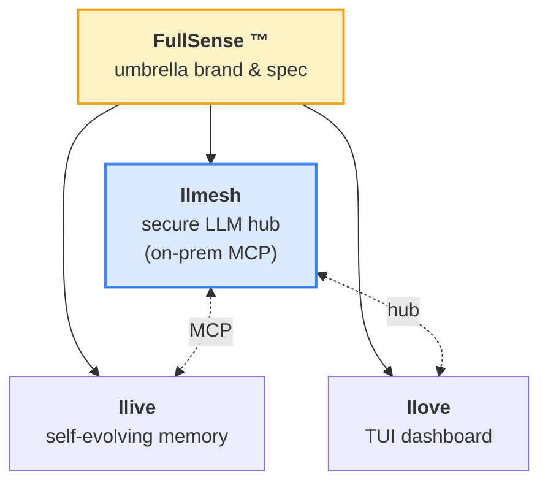
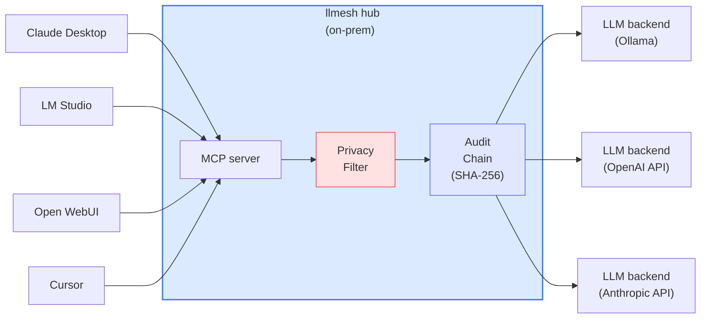

# FullSense ™ — llmesh

> **ざっくり何の文書？（中学生にもわかる説明）**
> このページは、いろいろな AI（人工知能）を 1 か所にまとめて安全に使うための道具「llmesh」の、案内地図のようなものです。会社の中の秘密や個人の情報を外に出さずに、自分のパソコンや社内のサーバーだけで AI を動かす仕組みを目指しています。下の表やリンクから、もっとくわしい説明のページへ進めます。
> 専門用語の意味は [用語集（GLOSSARY.md）](GLOSSARY.md) にまとめてあります。

---

> **Part of the [FullSense ™](https://github.com/furuse-kazufumi/llive/blob/main/TRADEMARK.md) family** — **llmesh** ・ `llive` ・ `llove` の 3 製品で構成される FullSense ブランドの中で、本サイトは **llmesh (secure LLM ハブ（LLM hub） over MCP)** の公式 documentation です。

---

## FullSense Family



| Product   | Role                                       | Site                                                |
|-----------|--------------------------------------------|-----------------------------------------------------|
| **llmesh** | secure LLM hub / on-prem MCP server        | this site                                          |
| **llive**  | self-evolving modular memory LLM framework | <https://furuse-kazufumi.github.io/llive/>          |
| **llove**  | TUI dashboard / HITL workbench             | <https://furuse-kazufumi.github.io/llove/>          |

## Architecture — Secure LLM Hub (MCP) Topology

llmesh は **on-prem MCP server** として複数の LLM client (Claude Desktop / LM Studio / Open WebUI / Cursor) を 1 つの hub に集約し、プライバシーフィルタ + 監査チェーンを挟む。



## Quick Start

```bash
pip install llmesh
```

詳細は [README.md](https://github.com/furuse-kazufumi/llmesh#readme) を参照。

## Documentation

| Topic               | File                                                  |
|---------------------|-------------------------------------------------------|
| Architecture        | [ARCHITECTURE.md](ARCHITECTURE.md)                    |
| API stability       | [API_STABILITY.md](API_STABILITY.md)                  |
| Deployment          | [DEPLOYMENT.md](DEPLOYMENT.md)                        |
| Development         | [DEVELOPMENT.md](DEVELOPMENT.md)                      |
| Glossary            | [GLOSSARY.md](GLOSSARY.md)                            |
| Industrial guide    | [INDUSTRIAL_GUIDE.md](INDUSTRIAL_GUIDE.md)            |
| Migration           | [MIGRATION.md](MIGRATION.md)                          |
| Observability       | [OBSERVABILITY.md](OBSERVABILITY.md)                  |
| Peering             | [PEERING.md](PEERING.md)                              |
| Performance         | [PERFORMANCE.md](PERFORMANCE.md)                      |
| Platforms           | [PLATFORMS.md](PLATFORMS.md)                          |
| Requirements        | [REQUIREMENTS.md](REQUIREMENTS.md)                    |
| Roadmap             | [ROADMAP.md](ROADMAP.md)                              |
| Security model      | [SECURITY.md](SECURITY.md)                            |
| Setup               | [SETUP.md](SETUP.md)                                  |
| Changelog           | [CHANGELOG.md](CHANGELOG.md)                          |

## Links

- **GitHub**: <https://github.com/furuse-kazufumi/llmesh>
- **PyPI**: <https://pypi.org/project/llmesh/>
- **Contact**: `kazufumi@furuse.work`

---

*FullSense ™ / llmesh ™ are trademarks of Kazufumi Furuse. Code distributed under Apache-2.0.*
